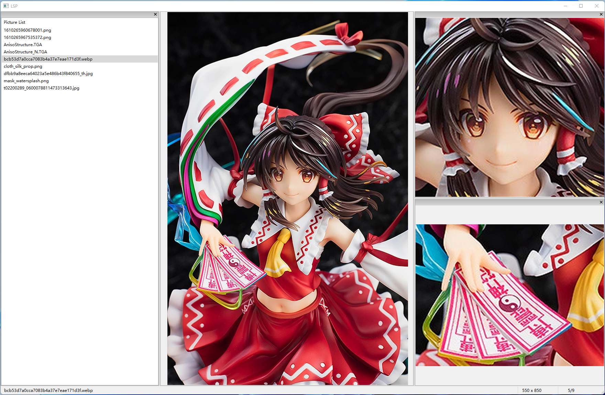

# LSP
CG browser, special for differential illustrations.

Support most image types and .zip .cbz .rar .cbr compress file.

Able to zoom up part of an image like this:

Require UnRAR to handle compressed files:https://www.rarlab.com/rar_add.htm

Only support 64bit Windows.

Operations:

++++++++++++++++++++++++++++++++++++++++++++++++++++++++++++++++

- Open file:      (Ctrl +) O, Left Double Click
- Fullscreen:     Enter, Middle Click
- Exit:           Esc
- Browse:         Mouse Wheel，Backspace|Space，←|→，PgUp|PgDn，(Ctrl +) A|D
- Zoom:           Ctrl + Mouse Wheel
- Local zoom:     Right Drag
- Reset:          Right Double Click
- Move:           Left Drag
- Rotate:         (Ctrl +) R|L
- Fit change:     Ctrl + Middle Click (Fit All, Width, Height）
- File list:      (Ctrl +) F
- Restore panels: (Ctrl +) H
- Change layout:  (Ctrl +) T

++++++++++++++++++++++++++++++++++++++++++++++++++++++++++++++++

专门用来浏览差分图像的软件，支持常见图像和压缩文件格式。可以在面板中局部放大图像的一部分。

图形界面使用的wx，压缩文件解压用到了zipfile和rarfile，需要使用外部的UnRAR：https://www.rarlab.com/rar_add.htm

只支持64位的windows，因为只是本人兴趣随便整的一个软件，不过还是把源码放上来吧。

在软件中按F1有操作说明。
